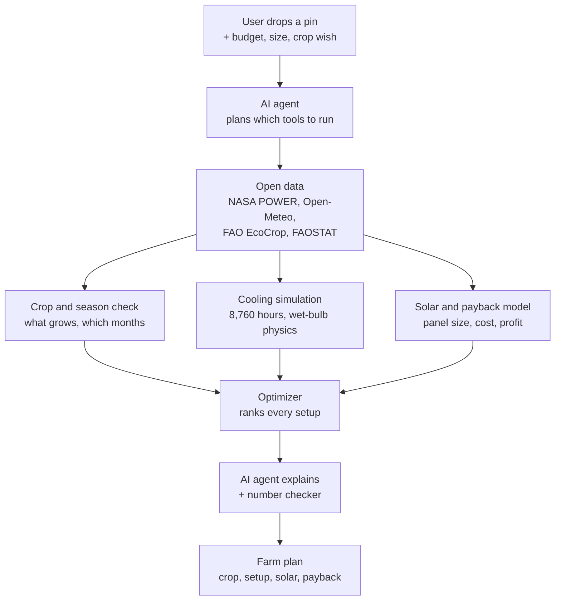

# Farming the Desert Sun: Problem and Solution

Sep 24, 2026 · @Blay

## 1. The problem

**Qatar has sunshine all year, yet imports most of its food. The sun is not the problem; the heat is.** For about seven months a year, Doha's daytime heat is above what common vegetables such as tomatoes can survive.

*(Chart or image: see the illustrated version in [01-problem-and-solution.pdf](01-problem-and-solution.pdf).)*

When crops overheat, flowers drop, fruit does not form, leaves scorch, and irrigation water evaporates before the plant can use it. So open-field farming works only in the cool months. Growing year-round needs cooling, and cooling costs money, water and energy.

This matters beyond Qatar. The Gulf imports about 85% of its food and is warming about twice as fast as the global average, so the problem grows every year.

## 2. Why it is hard to solve today

**Anyone planning a farm here must make three expensive decisions, and today they make them by guesswork.**

1. **What can I grow, and in which months?** Every crop has a heat limit, and every site has a different climate.
2. **What setup do I need?** Open field, a shade net, or a cooled greenhouse, and which kind of cooling.
3. **Will it make money?** Cooling is expensive, so the setup must pay back its cost.

The second decision hides a trap. The cheapest greenhouse cooling blows air through wet pads, and it can only cool air down toward its "wet-bulb" temperature. In dry air that works very well; in humid air it barely works. So two sites with the same temperature can need completely different greenhouses:

*(Chart or image: see the illustrated version in [01-problem-and-solution.pdf](01-problem-and-solution.pdf).)*

The dry inland greenhouse stays safely below the crop's limit. The humid coastal one, built the same way, cooks the crop. A thermometer alone cannot tell you this, so farmers often build the wrong system, lose the crop, and waste the investment.

## 3. How we solve it

**Our tool answers all three decisions at once, for any location, in seconds, before anyone spends money.**

What the user does:

1. Drops a pin on the map where they want to farm.
2. Enters a budget, farm size and, optionally, a crop they would like to grow.

What the tool does behind the scenes:

1. Pulls 20+ years of that site's real sun, temperature, humidity and dust data from satellites.
2. Checks every candidate crop against the site's climate, month by month.
3. Simulates every hour of a typical year (8,760 hours) inside each setup: open field, shade net, wet-pad greenhouse, chiller greenhouse.
4. Sizes solar panels to power the cooling, then calculates cost, water use, profit and payback.
5. Picks the best option and explains why in plain language.

What the user gets back:

*(Chart or image: see the illustrated version in [01-problem-and-solution.pdf](01-problem-and-solution.pdf).)*

*Mockup of the results screen, with illustrative numbers.* For this humid coastal site, the tool rules out cheap wet-pad cooling, recommends a solar-powered chiller greenhouse, and shows that it pays for itself in about 3.4 years.

## 4. Turning the sun into the solution

**We do not just avoid the heat; we use the sun to beat it.** A greenhouse needs cooling most in the hours when the sun is strongest, so solar panels produce power exactly when the cooling needs it.

*(Chart or image: see the illustrated version in [01-problem-and-solution.pdf](01-problem-and-solution.pdf).)*

This is also where "pays for itself" comes in. Every setup costs money up front and earns money from the crops it grows. Payback = years until the earnings cover the cost. The tool compares every option for the site. Example for a 500 m² humid coastal site (illustrative numbers):

| Setup | Months it can grow | Build cost | Profit per year | Payback | Profit over 10 years |
| --- | --- | --- | --- | --- | --- |
| Open field | 4 | 5,000 QAR | 3,000 QAR | 1.7 years | 25,000 QAR |
| Shade net | 5 | 20,000 QAR | 8,000 QAR | 2.5 years | 60,000 QAR |
| Wet-pad greenhouse | 7 (fails in humid summer) | 150,000 QAR | 30,000 QAR | 5.0 years | 150,000 QAR |
| **Solar-powered chiller greenhouse** | **12** | **230,000 QAR** | **68,000 QAR** | **3.4 years** | **450,000 QAR** |

The cheapest option pays back fastest but earns little. The tool recommends the setup that earns the most over the farm's life while keeping the crop alive, and shows every trade-off openly.

## 5. Can an AI agent make the decision?

**Yes, with one rule: the AI agent is the brain that plans and explains, and our physics and data tools are the calculator. The agent may never invent a number.**

An LLM on its own is risky for this job. It can confidently state a wrong payback, a made-up crop limit, or a data source that does not exist. A farmer who trusts that loses real money. So we use an **AI agent with tools**:

1. **Understands the goal.** The user can type naturally, for example "I have 250,000 QAR and want to sell leafy greens to Doha supermarkets."
2. **Plans and calls tools.** The agent decides which tools to run: fetch the climate data, check crops, simulate cooling, size the solar, calculate payback.
3. **Weighs trade-offs.** The optimizer ranks options by score; the agent adjusts the ranking to the user's priorities, such as lowest cost, fastest payback or least water.
4. **Explains and answers follow-ups.** "What if I double the budget?" makes the agent re-run the tools, never guess.

How we stop hallucinations:

| Risk | Guardrail |
| --- | --- |
| Agent invents a number | Every number comes from a tool output. The agent returns structured JSON that our code validates. |
| Explanation drifts from the results | A checker compares every number in the explanation with the tool outputs. Any mismatch is rejected and regenerated. |
| Made-up crop facts | Crop limits come only from the FAO EcoCrop table. The agent cannot recommend a crop that is not in it. |
| Missing or bad data | Tools return "unknown" instead of a guess, and the agent must say there is not enough data. |
| Different answer each time | Temperature set to 0 and a deterministic optimizer, so the same input gives the same plan. |
| False confidence | Every result shows its assumptions and data sources, and the user can edit the assumptions. |

The farmer always makes the final call; the tool advises. This directly answers the hackathon's "responsible AI use" criterion, and it is a strong line for judges: *our AI can plan, compare and explain, but it cannot make up a number.*

## 6. APIs and data we use

**Everything except the LLM is free, open and works for any point on Earth.**

| Source | Type | What we take from it | Cost / key |
| --- | --- | --- | --- |
| [NASA POWER](https://power.larc.nasa.gov/) | API | Hourly sunlight, temperature, humidity and wind, 20+ years | Free, no key |
| [Open-Meteo](https://open-meteo.com/) Air Quality API | API | Dust and haze levels | Free for non-commercial use, no key |
| [Open-Meteo](https://open-meteo.com/) Climate API | API | Climate projections to 2050 | Free for non-commercial use, no key |
| [FAO EcoCrop](https://gaez.fao.org/pages/ecocrop) | Dataset | Temperature and water limits for each crop | Free download |
| [FAOSTAT](https://www.fao.org/faostat/) | API / download | Crop prices, for revenue | Free |
| [Nominatim](https://nominatim.org/) (OpenStreetMap) | API | Turns a place name into coordinates | Free, fair-use limits |
| [Claude API](https://docs.claude.com/) | API | The AI agent: planning, tool calls, explanations | Paid per use, API key |

Open-source libraries: **pvlib** (solar panel output), **PsychroLib** (wet-bulb and humidity physics), **pandas** (data handling), **Streamlit** (web app) and **Leaflet** (interactive map).

To stay fully open, the agent layer is built so it can swap to an open-weight model later. All crop limits and cost assumptions live in editable CSV files, so any country can plug in its own local values.

## Sources

- [Arab News: GCC food imports (about 85%) and warming about twice the global rate](https://www.arabnews.com/node/2586821)
- Doha temperatures and crop limits in section 1 are approximate averages; the real app pulls exact values from NASA POWER and FAO EcoCrop.
- Greenhouse temperatures in section 2 are our own calculation. Numbers in sections 3 and 4 are illustrative.

## Solution map

The agent plans and explains at both ends; everything in between is data and physics, so every number in the final plan can be traced to a source.
