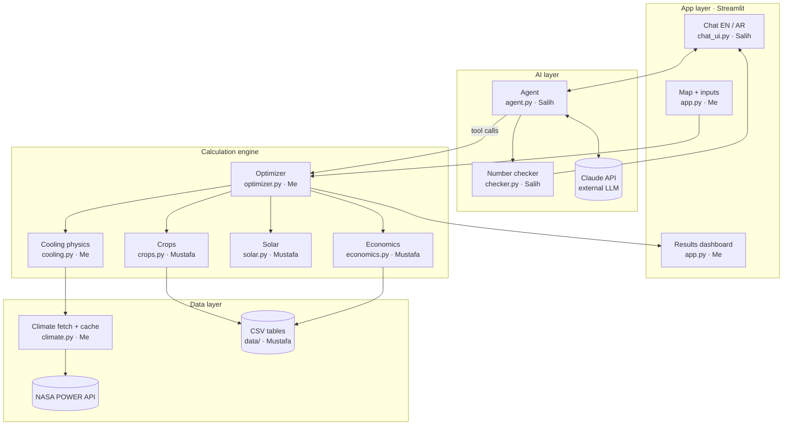

# Team tasks and system architecture

Sep 25, 2026 · @Blay · kept in sync with the code

## 1. Who does what

**Three people, three layers, no shared files.** Each person only edits the files they own, so nobody breaks anyone else's work.

| Person | Layer | Files they own | Stage 1 status |
| --- | --- | --- | --- |
| **Me** (repo owner) | Data pipeline, cooling physics, optimizer, main app; stage 2: controller and simulator page | `schemas.py`, `climate.py`, `cooling.py`, `optimizer.py`, `app.py`, `views/*`, `ui/*`, `.streamlit/config.toml`, `requirements.txt`; later `controller.py`, `views/operate.py` | Done on `jawad/core` |
| **Salih** | AI agent, number checker, English/Arabic chat | `agent.py`, `checker.py`, `chat_ui.py`, `i18n/*`, `styles/rtl.css`, `tests/test_agent.py`, `tests/test_checker.py`, `tests/test_i18n.py` | Done on `salih/agent-chat`; **Salih to review, especially the Arabic** |
| **Mustafa** | Data tables and sources, crop check, solar sizing, economics, README credits | `data/*.csv`, `crops.py`, `solar.py`, `economics.py`, `tests/test_mustafa.py`, README credits section | Done on `mustafa/core-modules`; **Mustafa to review and replace estimates with sources** |

Why this split: Salih's Arabic makes him the right person for the bilingual chat, and the agent with guardrails is the most complex AI piece. Mustafa's modules are simple arithmetic on tables with clear inputs and outputs. I own the core pipeline and the glue, since I control the repo.

Stage 1 code for Salih's and Mustafa's layers was written for them (with Claude Code) on their own branches so the whole app runs today. Ownership does not change: each person reviews their branch, owns it from now on, and does the "Your next tasks" list in their section.

## 2. System architecture

**Four layers: the app, the AI agent, the calculation engine and the data.** The LLM only talks to our own tools, never to raw data, so every number it says comes from the engine.



How a request flows: the user drops a pin (or types coordinates), `optimizer.plan()` runs the engine and the dashboard shows the result. In chat, the agent sends the question and the current plan to Claude with our tools attached; Claude asks to run a tool, the agent runs `optimizer.plan()` and returns the result; Claude writes the answer; the checker confirms every number matches before the user sees it. If the checker rejects the answer twice, the user gets a template answer built only from plan fields.

Stage 2 adds `controller.py` (called by `cooling.py` and the simulator page) and Open-Meteo dust data under `climate.py`.

### Components and licenses

| Component | Role | Open source? | License |
| --- | --- | --- | --- |
| [Streamlit](https://streamlit.io/) | Web app framework | Yes | Apache 2.0 |
| [folium](https://python-visualization.github.io/folium/) + streamlit-folium | Interactive map, pin clicks | Yes | MIT |
| [Plotly](https://plotly.com/python/) | Charts | Yes | MIT |
| [pandas](https://pandas.pydata.org/) + NumPy | Data tables and maths | Yes | BSD-3 |
| [PsychroLib](https://github.com/psychrometrics/psychrolib) | Wet-bulb temperature | Yes | MIT |
| [requests](https://requests.readthedocs.io/) | API calls | Yes | Apache 2.0 |
| [anthropic](https://github.com/anthropics/anthropic-sdk-python) Python SDK | Talks to the Claude API | Yes | MIT |
| [python-dotenv](https://github.com/theskumar/python-dotenv) | Loads `.env` | Yes | BSD-3 |
| Claude API | The LLM behind the agent | **No** (paid service) | Credited; kept swappable for an open-weight model |
| [NASA POWER](https://power.larc.nasa.gov/) | Climate data | Open data | Credit NASA POWER in README |
| [FAO EcoCrop](https://gaez.fao.org/pages/ecocrop) | Crop heat limits | Open data | Credit FAO |
| [FAOSTAT](https://www.fao.org/faostat/) | Crop prices | Open data | CC BY 4.0; credit FAO |
| [Open-Meteo](https://open-meteo.com/) Air Quality API | Dust (stage 2) | Open data | Free for non-commercial use; credit Open-Meteo and CAMS |

Our own code is MIT licensed. The only closed piece is the Claude API, and it is optional: set `LLM_PROVIDER=openai_compatible` to run the agent on an open-weight model such as [Qwen2.5 7B Instruct](https://ollama.com/library/qwen2.5) (Apache 2.0) through Ollama.

## 3. Shared contracts

**These names, columns and units are fixed. Extend them; never rename them without telling the whole team.** Everyone imports from `planner/schemas.py`.

```python
# planner/schemas.py  — owned by Me. Do not edit without asking.

CLIMATE_COLUMNS = [
    "hour_of_year",  # int 0..8759
    "month",         # int 1..12
    "temp_c",        # float, air temperature, °C
    "rh_pct",        # float, relative humidity, 0..100
    "ghi_wh_m2",     # float, solar energy that hour, Wh/m²
    "wind_ms",       # float, wind speed at 2 m, m/s
]
HOURS_PER_YEAR = 8760
SETUPS = ["open_field", "shade_net", "wet_pad", "chiller"]
STATUS = ["good", "risky", "impossible"]
MIN_COVERAGE_PCT = 90.0
PRIORITIES = ["profit", "payback", "water"]
```

| Function | Owner | Input | Output |
| --- | --- | --- | --- |
| `climate.get_typical_year(lat, lon)` | Me | floats | DataFrame with `CLIMATE_COLUMNS`; raises `ClimateUnavailable` when offline with no cache |
| `crops.load_crops()` | Mustafa | none | DataFrame from `data/crops.csv` |
| `crops.crop_calendar(climate_df, crops_df)` | Mustafa | DataFrames | DataFrame: rows = crop, columns = months 1–12, values from `STATUS` |
| `cooling.simulate(climate_df, setup, crop_limit_c, area_m2)` | Me | DataFrame, str, float, float | dict: `inside_temp_c` (list of 8,760), `coverage_pct`, `cooling_kwh_year`, `cooling_kwh_peak_day` |
| `solar.size_solar(cooling_kwh_peak_day, climate_df)` | Mustafa | float, DataFrame | dict: `solar_kw`, `solar_kwh_year`, `peak_sun_hours` |
| `economics.evaluate(setup, crop, area_m2, growing_months, cooling_kwh_year, solar_kw)` | Mustafa | str, str, floats | dict: `capex_qar`, `opex_qar_year`, `revenue_qar_year`, `profit_qar_year`, `payback_years`, `profit_10y_qar`, `water_l_day` (all `None` plus `reason` if data is missing) |
| `optimizer.plan(lat, lon, area_m2, budget_qar, priority, crop=None)` | Me | see names | dict (JSON-safe): `inputs`, `site`, `recommended`, `reason`, `options` (one per crop × setup), `calendar`, `sources`, `assumptions` |
| `agent.ask(message, history, current_plan)` | Salih | str, list, dict | dict: `reply`, `language` (`"en"`/`"ar"`), `verified` (bool), `plan` (new plan or None), `tool_log` |
| `checker.verify(reply, plan, tool_results, user_text="")` | Salih | str, dict, list, str | `(ok, bad_numbers)` |

Rules: every output must be JSON-safe (plain floats, strings, lists, dicts; no NumPy types), because the agent sends it to the LLM. Units always live in the key name: `_c`, `_qar`, `_kwh`, `_m2`, `_pct`, and in stage 2 `_w_m2`, `_kpa`, `_mol_m2_day`.

LLM settings (top of `agent.py`, overridable in `.env`):

| Setting | Default | Notes |
| --- | --- | --- |
| `LLM_PROVIDER` | `anthropic` | or `openai_compatible` for an open-source model |
| `LLM_MODEL` | `claude-sonnet-5`, or `qwen2.5:7b-instruct` for open models | `claude-haiku-4-5` saves credits |
| `LLM_BASE_URL` | `http://localhost:11434/v1` (Ollama) | any `/chat/completions` server |
| `LLM_API_KEY` | empty | only for hosted open-model services |

Claude gets no temperature (Sonnet 5 rejects it); open models get temperature 0. `MAX_TOKENS = 4096`, `MAX_TOOL_ROUNDS = 5`. Only `call_llm()` talks to a model, and both providers return the same response shape.

## 4. Rules for everyone

**Follow these exactly; most hackathon disasters are Git conflicts and leaked API keys, not bad code.**

### One-time setup (everyone)

```bash
git clone https://github.com/Jawad-23/RTE-Hack.git
cd RTE-Hack
python -m venv .venv
# Windows:  .venv\Scripts\activate
# Mac/Linux: source .venv/bin/activate
pip install -r requirements.txt
cp .env.example .env    # paste your own ANTHROPIC_API_KEY
python -m pytest        # everything should pass
streamlit run app.py
```

### Git workflow

1. Never commit directly to `main`. Work on your own branch: `<owner>/<feature>`, for example `mustafa/vpd-columns`.
2. Only edit files you own (section 1). Need a change in someone else's file? Message them.
3. Pull often: `git pull origin main` at least every 2 hours, and before opening a pull request.
4. Commit small and often with clear messages: `economics: add payback calculation`.
5. Open a pull request into `main`; I review and merge. Do not merge your own PR.
6. Before pushing, run `python -m pytest` and make sure all tests pass.

### Branches right now

`main` holds the whole working project and is what the live app (https://croptions.streamlit.app) runs. The stage 1 branches were stacked so each person could review their part:

```
claude/rte-hack-repo-setup-acjcdd   docs + UI demo
└── jawad/core                      scaffold, climate, cooling, optimizer, app
    └── mustafa/core-modules        crops, solar, economics, CSV sources, credits
        └── salih/agent-chat        agent, checker, chat, i18n
            └── jawad/docs-sync     docs synced with the code  ==  main
                └── jawad/redesign  Croptions look and feel (open for review)
```

New work branches from `main` and comes back through a pull request.

### Secrets

- The Claude API key lives only in a `.env` file on your own laptop: `ANTHROPIC_API_KEY=...`.
- `.env` is in `.gitignore`. **Never paste the key into code, Slack or a commit.** A leaked key must be revoked immediately.
- For the hosted demo, the key goes into Streamlit Cloud's Secrets settings, never the repo.

### Code rules

- Python 3.11. Use the names and units from `schemas.py`; never invent new column names.
- Every public function gets a one-line docstring saying inputs, outputs and units.
- No hard-coded parameters in code; every number that could change goes in `data/*.csv` with a `source` column. No real source means the source says `estimate`.
- Missing data returns `None` with a reason, never a guessed number. NASA POWER's fill value `-999` is NaN.
- Never show a performance claim (in the UI, README or agent prompt) that the code does not calculate.
- Do not add a new library without asking me; I add it to `requirements.txt`.
- No hardware code: no microcontroller, sensor, MQTT or device code. Cameras and ESP32 are roadmap only.

## 5. My tasks (repo owner)

### Stage 1: done

- [x] Repo with MIT license, `.gitignore` (`.env`, `.venv/`, `data/cache/`, `__pycache__/`), pinned `requirements.txt`, `.env.example`
- [x] `planner/schemas.py` and working stubs for every module
- [x] `climate.py`: NASA POWER hourly fetch for the 5 most recent full years, fill values as NaN, unit check, drop 29 Feb, average into 8,760 rows, cache in `data/cache/`, fail fast when offline
- [x] `cooling.py`: wet-bulb with PsychroLib (Stull fallback), inside temperature for the 4 setups, chiller energy, coverage, peak-day energy; solar heat gain applies only while the sun is up
- [x] `optimizer.py`: every crop × setup, filter on coverage and budget, rank by priority, one-sentence reason, sources and assumptions, JSON-safe, `python -m planner.optimizer LAT LON` prints a plan
- [x] `app.py`: map plus "Or type coordinates" fallback, inputs, recommendation tiles, crop calendar heatmap, comparison table, inside-temperature chart, hottest-day solar chart (only when there is cooling to power), 10-year profit chart, assumptions and sources, English/Arabic toggle with RTL

- [x] Redesign to match the Croptions prototype (`jawad/redesign`): five pages in `views/`, design tokens and components in `ui/`, English/Arabic labels from the prototype, chat in an "Ask Croptions" dialog, compare-sites page, UI smoke tests

### Your next tasks

- [x] Create `main` and merge the stage 1 branches in the order in section 4
- [ ] Merge `jawad/redesign` into `main` to update the live app
- [ ] Invite Salih and Mustafa as collaborators (GitHub → Settings → Collaborators); protect `main`
- [ ] Run `python -m planner.climate 25.29 51.53` on a laptop to test the live NASA fetch (it could not be tested from the build environment)
- [ ] Pick and cache the two demo pins (dry inland, humid coastal)
- [ ] Stage 2 steps 1, 5, 6 and your parts of 2, 3, 4, 7 (section 9)

## 6. Salih's tasks: AI agent and bilingual chat

### Stage 1: done (please review)

- [x] `agent.py`: tools `run_plan` and `compare_sites`, tool loop capped at 5 rounds, current plan in the first user turn, language detection, `tool_log`, only `call_llm()` talks to the API
- [x] `checker.py`: `extract_numbers` (Western and Arabic-Indic digits, `٫` and `٬`, commas), `allowed_numbers` (every number in the plan, tool results and the user's message), `verify` with 1 % / ±0.1 tolerance, months 1–12 and years 2000–2100 allowed
- [x] Rewrite once on a failed check, then a template answer from plan fields in the right language
- [x] `i18n/en.json` and `i18n/ar.json` with identical keys, `t(key, lang)` with English fallback and a warning
- [x] `chat_ui.py`: history, 4 suggested prompts, "Verified" badge, tool log in an expander, "Plan updated" note, Arabic in `dir="rtl"`
- [x] `styles/rtl.css`: RTL text, LTR charts, tables, metrics and number inputs
- [x] Tests: made-up payback fails, plan number passes, Arabic-Indic digits pass, i18n keys match, agent loop with a fake LLM
- [x] Open-source model support: `LLM_PROVIDER=openai_compatible` works with Ollama, llama.cpp, vLLM, LM Studio, Groq or OpenRouter; tested against a fake server

System prompt (in `agent.py`):

```
You are a farm planning assistant for hot, arid regions.
Rules:
1. Use ONLY numbers that appear in the current plan or in tool results. Never estimate, round creatively, or invent a number.
2. If the user asks "what if", call a tool and answer from its result.
3. If the data does not answer the question, say so plainly.
4. Reply in the same language as the user. For Arabic, use clear Modern Standard Arabic and Western digits.
5. Always include units (°C, QAR, m², kW, years).
6. Keep answers short: the answer first, then one or two reasons.
7. You advise; the farmer makes the final decision.
```

### Your next tasks

- [ ] Review `salih/agent-chat`; you own it from now on
- [ ] **Review every Arabic string** in `i18n/ar.json`. They were written without a native speaker; make them natural and simple for farmers
- [ ] With your own key in `.env`, test 4 English and 4 Arabic questions end to end and save the good transcripts
- [ ] Try the open-source path: install [Ollama](https://ollama.com), `ollama pull qwen2.5:7b-instruct`, set `LLM_PROVIDER=openai_compatible` in `.env`, and run the same 8 questions. Note how often the checker has to step in
- [ ] Stage 2 step 9: agent and checker updates, Arabic for new labels (they will arrive as `TODO_AR: <English>`)

## 7. Mustafa's tasks: data tables, crops, solar, economics

### Stage 1: done (please review)

- [x] `crops.py`: `load_crops()`, `crop_calendar()` from average daily max/min per month: `good`, `risky` (up to 3 °C over the limit), `impossible`
- [x] `solar.py`: `peak_sun_hours` from `ghi_wh_m2`, `solar_kw` sized for the peak cooling day, `performance_ratio` from `settings.csv`, zeros when there is no cooling
- [x] `economics.py`: capex (setup + solar), revenue, opex, profit, payback (`None` if no profit), 10-year profit, water; missing data returns `None` with a reason
- [x] `tests/test_mustafa.py`: capex 200,000 and profit 60,000 give payback 3.33; zero cooling gives `solar_kw` 0; a 45 °C month is `impossible` for lettuce
- [x] README Credits section

### Your next tasks

- [ ] Review `mustafa/core-modules`; you own it from now on
- [ ] **Replace estimates with real sources.** Every row in `data/*.csv` is marked `estimate`. In priority order:
  1. `setups.csv`: `capex_qar_m2` and `opex_qar_m2_year` for each setup, and `chiller_kw_per_m2_per_c`. These decide whether the solar chiller pays off, which is the pitch's main story
  2. `settings.csv`: `solar_capex_qar_kw`, `electricity_price_qar_kwh`
  3. `crops.csv`: temperature limits from [FAO EcoCrop](https://gaez.fao.org/pages/ecocrop), yields, water use
  4. `prices.csv`: [FAOSTAT](https://www.fao.org/faostat/) or Doha market prices
- [ ] Stage 2: new CSV columns and rows (section 9), economics for electricity sales and cleaning

## 8. Integration checkpoints

**We stop and connect our work together at fixed times, so problems show up early instead of on Saturday morning.**

| When | Checkpoint | Me | Salih | Mustafa |
| --- | --- | --- | --- | --- |
| Fri, hour 1 | Repo live | Done | Clone, `pytest`, app runs | Clone, `pytest`, app runs |
| Fri 13:00 | Modules work alone | Done | Done; review | Done; review |
| Fri 17:00 | **Full pipeline** | Done: `optimizer.plan()` prints a plan | Done: checker blocks a fake number | Done |
| Fri 21:00 | **App end to end** | Merge into `main`; live NASA test | Live chat test in English and Arabic | Sources for the top estimates |
| Sat 08:00–10:00 | Polish | Test 5 pins, cache demo pins | Test 8 demo questions | Double-check every CSV source |
| Sat 10:00 | **Code freeze** | Tag the final commit | No new features | No new features |

At each checkpoint, merge all open pull requests into `main`, then everyone pulls and runs the app once. If a checkpoint is missed by more than an hour, we cut a stretch feature, never a must-have.

## 9. Stage 2: smarter shading and dust

**Planned. Work in this order; stop after each step, show the diff and test results, and get a go-ahead before the next.** One feature per branch, named `<owner>/<feature>`. The app stays a planning tool: no hardware code.

| Step | What | Me | Mustafa | Salih |
| --- | --- | --- | --- | --- |
| 1 | Split sunlight: add NASA POWER `ALLSKY_SFC_PAR_TOT`, `ALLSKY_SFC_UVA`, `ALLSKY_SFC_UVB`, `ALLSKY_SFC_LW_DWN`, `CLRSKY_SFC_SW_DWN`, `CLRSKY_SFC_PAR_TOT`. New columns `par_w_m2`, `uv_w_m2`, `nir_w_m2`, `lw_down_w_m2`, `clearsky_ghi_w_m2`, `clearsky_par_w_m2`, `heat_share`. Invalidate old caches | `climate.py`, `schemas.py` | | |
| 2 | VPD stress and inside humidity per setup; `vpd_stress_hours`, `inside_rh_pct` in `simulate()` | `cooling.py` | `crops.csv`: `vpd_max_kpa` | |
| 3 | Daily light integral; `light_ok_pct`; reject setups below `MIN_LIGHT_OK_PCT` (90) | `cooling.py`, `optimizer.py`, `schemas.py` | `crops.csv`: `dli_min_mol_m2_day`; `crops.py` DLI | |
| 4 | New setups `nir_screen_wet_pad`, `agrivoltaic_fixed`, `agrivoltaic_louver` | `cooling.py`, `schemas.py` | `setups.csv` columns and rows; `settings.csv`: `electricity_sell_qar_kwh`; `economics.py` electricity revenue (new keyword arguments with defaults) | |
| 5 | Shared rule-based controller `decide(hour_row, crop, state) -> {screen_pct, reason}`, 10 % steps, thresholds in `settings.csv` | `controller.py` | `settings.csv` thresholds | |
| 6 | Operate simulator page: one day at 10-minute steps, fixed shade vs smart screen, Play button, CSV export, "Simulation using satellite climate data for this site. Not live sensor data." | `views/operate.py` (added to the top bar in `app.py`) | | Arabic for the banner |
| 7 | Dust: haze light loss, cleaning interval (7/14/30 days), Open-Meteo dust-storm exposure | `climate.py`, `optimizer.py` | `settings.csv` rates, thresholds, costs; `economics.py` cleaning cost and water | |
| 8 | Stretch: area scan, up to 25 points | `app.py` | | |
| 9 | Wire everything through the dashboard, agent, checker, i18n, README and these docs | `app.py`, docs | README credits | `agent.py`, `checker.py`, Arabic |

### Decisions still open before stage 2 starts

- **Hourly availability.** `ALLSKY_SFC_PAR_TOT`, `ALLSKY_SFC_UVA` and `ALLSKY_SFC_UVB` are listed as hourly in W/m². `CLRSKY_SFC_PAR_TOT`, `CLRSKY_SFC_SW_DWN` and `ALLSKY_SFC_LW_DWN` still need confirming at hourly resolution. The hourly API allows at most 15 parameters per request (we would use 10). Solar data is at about 1° resolution.
- **Open-Meteo dust history.** Hourly `dust` in µg/m³ from CAMS global (about 40 km). How many past years are available has not been confirmed.
- **Step 3 needs `par_transmission` for the existing greenhouse setups** (currently only planned for step 4). Proposal: add the column in step 3, with open field = 1.
- **Step 3 "growing days":** days in months with at least 90 % coverage, or all 365 days?
- **Step 7 lost revenue from light loss** needs a yield-per-light factor in `settings.csv` (`estimate` unless sourced).
- **`heat_share` is NaN at night**, so the climate table check must allow NaN in that one column.
