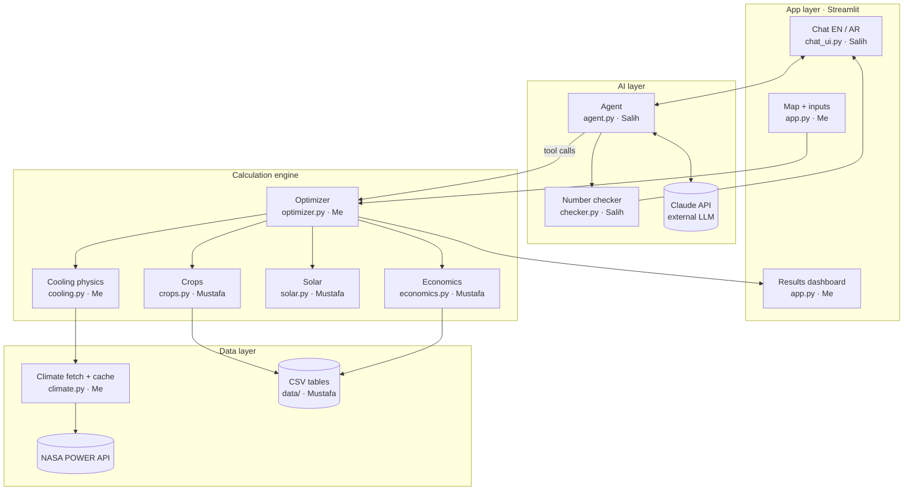

# Team tasks and system architecture

Sep 25, 2026 · @Blay

## 1. Who does what

**Three people, three layers, no shared files.** Each person only edits the files they own, so nobody breaks anyone else's work.

| Person | Layer | Files they own | Difficulty |
| --- | --- | --- | --- |
| **Me** (repo owner) | Data pipeline, cooling physics, optimizer, main app | `schemas.py`, `climate.py`, `cooling.py`, `optimizer.py`, `app.py`, `requirements.txt` | Hard |
| **Salih** | AI agent, number checker, English/Arabic chat | `agent.py`, `checker.py`, `chat_ui.py`, `i18n/en.json`, `i18n/ar.json`, `styles/rtl.css` | Hard |
| **Mustafa** | Data tables, crop check, solar sizing, economics, README credits | `data/*.csv`, `crops.py`, `solar.py`, `economics.py`, `tests/test_mustafa.py`, README credits section | Easy |

Why this split: Salih's Arabic makes him the right person for the bilingual chat, and the agent with guardrails is the most complex AI piece. Mustafa's modules are simple arithmetic on tables with clear inputs and outputs, so he can finish them and learn the codebase without blocking anyone. I own the core pipeline and the glue, since I control the repo.

## 2. System architecture

**Four layers: the app, the AI agent, the calculation engine and the data.** The LLM only talks to our own tools, never to raw data, so every number it says comes from the engine.



How a request flows: the user drops a pin, `optimizer.plan()` runs the engine and the dashboard shows the result. In chat, the agent sends the question to Claude with our tools attached; Claude asks to run a tool, the agent runs `optimizer.plan()` and returns the result; Claude writes the answer; the checker confirms every number matches before the user sees it.

### Components and licenses

| Component | Role | Open source? | License |
| --- | --- | --- | --- |
| [Streamlit](https://streamlit.io/) | Web app framework | Yes | Apache 2.0 |
| [folium](https://python-visualization.github.io/folium/) + streamlit-folium | Interactive map, pin clicks | Yes | MIT |
| [Plotly](https://plotly.com/python/) | Charts | Yes | MIT |
| [pandas](https://pandas.pydata.org/) + NumPy | Data tables and maths | Yes | BSD-3 |
| [PsychroLib](https://github.com/psychrometrics/psychrolib) | Wet-bulb temperature | Yes | MIT |
| [requests](https://requests.readthedocs.io/) | API calls | Yes | Apache 2.0 |
| [anthropic](https://github.com/anthropics/anthropic-sdk-python) Python SDK | Talks to the Claude API | Yes | MIT |
| Claude API | The LLM behind the agent | **No** (paid service) | Credited; kept swappable for an open-weight model |
| [NASA POWER](https://power.larc.nasa.gov/) | Climate data | Open data | Credit NASA POWER in README |
| [FAO EcoCrop](https://gaez.fao.org/pages/ecocrop) | Crop heat limits | Open data | Credit FAO |
| [FAOSTAT](https://www.fao.org/faostat/) | Crop prices | Open data | Credit FAO; check terms |

Our own code is MIT licensed. The only closed piece is the LLM, which is why the agent talks to it through one small function that another model can replace.

## 3. Shared contracts

**These names, columns and units are fixed. Nobody renames them without telling the whole team.** I commit `schemas.py` in the first hour; everyone imports from it.

```python
# planner/schemas.py  — owned by Me. Do not edit without asking.

# Climate table: 8,760 rows, one per hour of a typical year
CLIMATE_COLUMNS = [
    "hour_of_year",  # int 0..8759
    "month",         # int 1..12
    "temp_c",        # float, air temperature, °C
    "rh_pct",        # float, relative humidity, 0..100
    "ghi_wh_m2",     # float, solar energy that hour, Wh/m²
    "wind_ms",       # float, wind speed at 2 m, m/s
]

# The four setups, always these exact strings
SETUPS = ["open_field", "shade_net", "wet_pad", "chiller"]

# Crop calendar statuses
STATUS = ["good", "risky", "impossible"]

# Coverage threshold for a setup to be acceptable
MIN_COVERAGE_PCT = 90.0
```

| Function | Owner | Input | Output |
| --- | --- | --- | --- |
| `climate.get_typical_year(lat, lon)` | Me | floats | DataFrame with `CLIMATE_COLUMNS` |
| `crops.load_crops()` | Mustafa | none | DataFrame from `data/crops.csv` |
| `crops.crop_calendar(climate_df, crops_df)` | Mustafa | DataFrames | DataFrame: rows = crop, columns = months 1–12, values from `STATUS` |
| `cooling.simulate(climate_df, setup, crop_limit_c, area_m2)` | Me | DataFrame, str, float, float | dict: `inside_temp_c` (list of 8,760), `coverage_pct`, `cooling_kwh_year`, `cooling_kwh_peak_day` |
| `solar.size_solar(cooling_kwh_peak_day, climate_df)` | Mustafa | float, DataFrame | dict: `solar_kw`, `solar_kwh_year`, `peak_sun_hours` |
| `economics.evaluate(setup, crop, area_m2, growing_months, cooling_kwh_year, solar_kw)` | Mustafa | str, str, floats | dict: `capex_qar`, `opex_qar_year`, `revenue_qar_year`, `profit_qar_year`, `payback_years`, `profit_10y_qar`, `water_l_day` |
| `optimizer.plan(lat, lon, area_m2, budget_qar, priority, crop=None)` | Me | see names | dict (JSON-safe): `site`, `recommended`, `options` (list, one per setup × crop), `calendar`, `sources`, `assumptions` |
| `agent.ask(message, history, current_plan)` | Salih | str, list, dict | dict: `reply`, `language` (`"en"`/`"ar"`), `verified` (bool), `plan` (new plan or None), `tool_log` |

Rules: every output must be JSON-safe (plain floats, strings, lists, dicts; no NumPy types), because the agent sends it to the LLM. Units always live in the key name: `_c`, `_qar`, `_kwh`, `_m2`, `_pct`.

## 4. Rules for everyone

**Follow these exactly; most hackathon disasters are Git conflicts and leaked API keys, not bad code.**

### One-time setup (everyone)

```bash
git clone https://github.com/<my-username>/desert-farm-planner.git
cd desert-farm-planner
python -m venv .venv
# Windows:  .venv\Scripts\activate
# Mac/Linux: source .venv/bin/activate
pip install -r requirements.txt
```

### Git workflow

1. Never commit directly to `main`. Work on your own branch: `git checkout -b <your-name>/<module>`, for example `mustafa/economics`.
2. Only edit files you own (section 1). Need a change in someone else's file? Message them.
3. Pull often: `git pull origin main` at least every 2 hours, and before opening a pull request.
4. Commit small and often with clear messages: `economics: add payback calculation`.
5. Open a pull request into `main`; I review and merge. Do not merge your own PR.
6. Before pushing, run `python -m pytest` and make sure your tests pass.

### Secrets

- The Claude API key lives only in a `.env` file on your own laptop: `ANTHROPIC_API_KEY=...`.
- `.env` is in `.gitignore`. **Never paste the key into code, Slack or a commit.** A leaked key must be revoked immediately.
- For the hosted demo, the key goes into Streamlit Cloud's Secrets settings, never the repo.

### Code rules

- Python 3.11. Use the names and units from `schemas.py`; never invent new column names.
- Every public function gets a one-line docstring saying inputs, outputs and units.
- No hard-coded Qatar values in code; all numbers that could change go in `data/*.csv`.
- Missing data returns `None` with a reason, never a guessed number.
- Do not add a new library without asking me; I add it to `requirements.txt`.

## 5. My tasks (repo owner)

**First job: unblock the others within the first hour with a repo, contracts and working stubs.** Then build the data pipeline, the cooling physics, the optimizer and the main app.

### Step 1: Create the repository (first 45 minutes)

- [ ] Create a **public** GitHub repo `desert-farm-planner` with an **MIT license** and the Python `.gitignore` template.
- [ ] Add to `.gitignore`: `.env`, `.venv/`, `data/cache/`, `__pycache__/`.
- [ ] Invite Salih and Mustafa as collaborators. In Settings → Branches, protect `main` so it needs a pull request.
- [ ] Create the folder structure from the Project plan tab, plus `i18n/`, `styles/` and `data/cache/`.
- [ ] Commit `planner/schemas.py` (section 3).
- [ ] Commit `requirements.txt`: `streamlit`, `folium`, `streamlit-folium`, `plotly`, `pandas`, `numpy`, `psychrolib`, `requests`, `anthropic`, `python-dotenv`, `pytest`. After installing, pin versions with `pip freeze`.
- [ ] Commit a **stub** for every module: each function exists with the exact signature from section 3 and returns fake but correctly shaped data. This lets Salih and Mustafa test their code before mine is finished.
- [ ] Post the repo link in the team chat and confirm everyone can clone and run `streamlit run app.py`.

### Step 2: `climate.py`, the data pipeline

- [ ] Call the NASA POWER hourly endpoint for 5 recent full years, one year per request:

```
https://power.larc.nasa.gov/api/temporal/hourly/point?parameters=T2M,RH2M,ALLSKY_SFC_SW_DWN,WS2M&community=AG&latitude={lat}&longitude={lon}&start=20190101&end=20191231&format=JSON&time-standard=LST
```

- [ ] Values sit under `properties.parameter.<NAME>`, keyed by `YYYYMMDDHH`. Replace the fill value `-999` with NaN.
- [ ] Check the units block in the response for `ALLSKY_SFC_SW_DWN` and convert to Wh/m² per hour if needed.
- [ ] Drop 29 February, then average each (month, day, hour) across the years to build a typical year of exactly 8,760 rows with `CLIMATE_COLUMNS`.
- [ ] Cache the result as `data/cache/{lat:.2f}_{lon:.2f}.csv` and read from the cache first. Pre-cache both demo pins on Friday.

### Step 3: `cooling.py`, the physics

- [ ] Wet-bulb with PsychroLib in SI units: `psychrolib.SetUnitSystem(psychrolib.SI)`, then `GetTWetBulbFromRelHum(temp_c, rh_pct / 100, 101325)`. Apply it to all 8,760 rows.
- [ ] Inside temperature per setup, using parameters from `data/setups.csv`:
  - `open_field`: outside temperature
  - `shade_net`: outside temperature minus `shade_drop_c`
  - `wet_pad`: `T - pad_efficiency * (T - Tw) + solar_gain_c`
  - `chiller`: `setpoint_c` whenever the wet-pad temperature is above it; energy = area × `chiller_kw_per_m2_per_c` × (wet-pad temperature − setpoint) ÷ `cop`, per hour
- [ ] Coverage = % of hours where inside temperature is below the crop's `t_max_c`.
- [ ] Return the dict from section 3, including the highest single-day cooling energy (`cooling_kwh_peak_day`).
- [ ] Test: a dry site (40°C, 15% RH) must show much lower wet-pad temperatures than a humid one (40°C, 60% RH).

### Step 4: `optimizer.py`, the decision

- [ ] For every crop × setup: run the crop calendar, cooling, solar and economics.
- [ ] Keep options with coverage of at least `MIN_COVERAGE_PCT` and `capex_qar` within budget.
- [ ] Rank by the chosen priority: `profit` (highest `profit_10y_qar`), `payback` (lowest `payback_years`) or `water` (lowest `water_l_day`).
- [ ] If nothing passes, return `recommended: None` with a reason, e.g. "No setup keeps tomatoes below their heat limit within this budget."
- [ ] Add `sources` (dataset name, URL, fetch date) and `assumptions` (every CSV value used). Convert everything to plain Python types.

### Step 5: `app.py`, the main app

- [ ] Sidebar: language toggle (English / العربية), farm size, budget, optional crop, priority. All labels come from Salih's `t(key, lang)` function.
- [ ] Map with `st_folium`; read the clicked point from `last_clicked`.
- [ ] "Analyse this site" button: call `optimizer.plan()`, show a spinner with the step list, store the result in `st.session_state["plan"]`.
- [ ] Results: recommendation card, `st.metric` tiles, crop calendar heatmap (Plotly), comparison table, inside-temperature chart, solar-vs-cooling day chart, 10-year profit chart, assumptions and sources expanders.
- [ ] Mount Salih's chat with `chat_ui.render(st.session_state.get("plan"), lang)`.
- [ ] When `lang == "ar"`, load `styles/rtl.css` with `st.markdown(..., unsafe_allow_html=True)`.

## 6. Salih's tasks: AI agent and bilingual chat

**Build the agent that plans with tools, the checker that blocks invented numbers, and the English/Arabic chat.** Until my optimizer is ready, work against the stub `optimizer.plan()`, which already returns correctly shaped fake data.

### Step 1: `agent.py`, the agent loop

- [ ] Load the key with `python-dotenv`; create `client = anthropic.Anthropic()` (it reads `ANTHROPIC_API_KEY` automatically).
- [ ] Keep all LLM settings in one place at the top: `MODEL = "claude-sonnet-5"` (switch to `"claude-haiku-4-5-20251001"` to save credits), `TEMPERATURE = 0`, `MAX_TOKENS = 1024`. Only one function, `call_llm()`, talks to the API, so the model can be swapped later.
- [ ] Define two tools with JSON schemas:
  - `run_plan`: `lat`, `lon`, `area_m2`, `budget_qar`, `priority` (enum `profit` / `payback` / `water`), optional `crop`. Runs `optimizer.plan()`.
  - `compare_sites`: two sets of `lat`, `lon` plus shared inputs. Runs `optimizer.plan()` twice.
- [ ] Tool loop: call the model; while `stop_reason == "tool_use"`, run each requested tool, send back a `tool_result`, call again. Stop after 5 rounds to prevent loops.
- [ ] Pass the current plan as JSON in the first user turn, so questions like "why not wet pads?" need no new tool call.
- [ ] Detect language: if the message contains any character in the Arabic range `\u0600–\u06FF`, set `language = "ar"`, else `"en"`.
- [ ] Return the dict from section 3, with `tool_log` as a short readable list, e.g. `["run_plan(budget_qar=125000)"]`.

System prompt (start from this, tune it):

```
You are a farm planning assistant for hot, arid regions.
Rules:
1. Use ONLY numbers that appear in the current plan or in tool results. Never estimate, round creatively, or invent a number.
2. If the user asks "what if", call a tool and answer from its result.
3. If the data does not answer the question, say so plainly.
4. Reply in the same language as the user. For Arabic, use clear Modern Standard Arabic and Western digits.
5. Always include units (°C, QAR, m², kW, years).
6. Keep answers short: the answer first, then one or two reasons.
7. You advise; the farmer makes the final decision.
```

### Step 2: `checker.py`, the hallucination guard

- [ ] `extract_numbers(text)`: find every number in the reply. Convert Arabic-Indic digits (٠–٩) to Western digits first, and handle the Arabic decimal and thousands separators (٫, ٬) and normal commas.
- [ ] `allowed_numbers(plan, tool_results)`: walk the dicts recursively and collect every number.
- [ ] `verify(reply, plan, tool_results)`: a number passes if it is within 1% (or ±0.1) of an allowed number. Also allow months 1–12 and years 2000–2100. Return `(ok, bad_numbers)`.
- [ ] In `agent.ask`: if the check fails, ask the model once to rewrite using only allowed numbers, naming the bad ones. If it fails again, return a safe template answer built directly from the plan fields, in the right language.

### Step 3: `i18n/`, translations

- [ ] `i18n/en.json` and `i18n/ar.json` with **identical keys** for every label, button, placeholder, error and empty state from the UI design prompt.
- [ ] `i18n/__init__.py` with `t(key, lang)`: returns the string, falls back to English and prints a warning if the key is missing.
- [ ] Write the Arabic yourself and keep it natural and simple for farmers, not machine-literal.

### Step 4: `chat_ui.py` and `styles/rtl.css`

- [ ] `render(plan, lang)`: keep history in `st.session_state["chat"]`; draw messages with `st.chat_message`; input with `st.chat_input(t("chat_placeholder", lang))`.
- [ ] Empty chat: show 4 suggested prompts as buttons in the current language (the list is in the UI design prompt).
- [ ] Under each assistant message: a small "Verified" / "تم التحقق" badge when `verified` is true, and the `tool_log` inside a collapsed `st.expander`.
- [ ] If `agent.ask` returns a new `plan`, save it to `st.session_state["plan"]` and show a "Plan updated" note, so my dashboard redraws.
- [ ] Arabic messages go inside `<div dir="rtl">` so mixed Arabic/English text reads correctly.
- [ ] `rtl.css`: set the app to `direction: rtl; text-align: right`, but keep charts, tables and number inputs `direction: ltr` so they don't break.

### Step 5: Tests

- [ ] `tests/test_checker.py`: a reply with a made-up payback must fail; the same reply with the plan's number must pass; an Arabic reply with Arabic-Indic digits must pass.
- [ ] `tests/test_i18n.py`: `en.json` and `ar.json` have exactly the same keys.
- [ ] Before the demo, test 4 English and 4 Arabic questions end to end and save the good transcripts.

## 7. Mustafa's tasks: data tables, crops, solar, economics

**Everything here is simple arithmetic on tables. Do the steps in order, run the tests after each one, and ask in the team chat if anything is unclear.** Never change a column name.

### Step 1: The data files (do these first; everyone needs them)

- [ ] `data/crops.csv`, one row per crop, about 8 crops (tomato, cucumber, lettuce, bell pepper, eggplant, okra, melon, strawberry). Take temperature limits from [FAO EcoCrop](https://gaez.fao.org/pages/ecocrop) and write the source in the last column.

```csv
crop,t_min_c,t_opt_min_c,t_opt_max_c,t_max_c,yield_kg_m2_year,water_l_m2_day,source
tomato,0,0,0,0,0,0,FAO EcoCrop (fill real values)
```

- [ ] `data/prices.csv`: crop prices in QAR per kg, from [FAOSTAT](https://www.fao.org/faostat/) or local market data.

```csv
crop,price_qar_kg,source,year
tomato,0,FAOSTAT (fill real value),2024
```

- [ ] `data/setups.csv`: exactly 4 rows, using the setup names from `schemas.py`. Leave a cell as `0` when it does not apply (for example, `pad_efficiency` for `open_field`).

```csv
setup,capex_qar_m2,opex_qar_m2_year,shade_drop_c,pad_efficiency,solar_gain_c,setpoint_c,chiller_kw_per_m2_per_c,cop,water_l_m2_day_extra,yield_factor,source
open_field,0,0,0,0,0,0,0,0,0,1.0,estimate
shade_net,0,0,2,0,0,0,0,0,0,1.0,estimate
wet_pad,0,0,0,0.8,4,0,0,0,0,1.0,estimate
chiller,0,0,0,0.8,4,26,0,3.0,0,1.0,estimate
```

- [ ] `data/settings.csv`: one value per row, for costs shared by all setups.

```csv
key,value,unit,source
electricity_price_qar_kwh,0,QAR/kWh,fill
solar_capex_qar_kw,0,QAR/kW,fill
performance_ratio,0.8,fraction,typical value
```

The zeros are placeholders showing the format. Fill real values, and write where each came from in the `source` column. If you can't find one, make a sensible estimate and write `estimate`; we label these "illustrative" in the demo.

### Step 2: `economics.py`

- [ ] Implement `evaluate(setup, crop, area_m2, growing_months, cooling_kwh_year, solar_kw)` by reading the CSVs with pandas:
  - `capex_qar` = area × `capex_qar_m2` + `solar_kw` × `solar_capex_qar_kw`
  - `revenue_qar_year` = area × `yield_kg_m2_year` × `price_qar_kg` × (`growing_months` ÷ 12) × `yield_factor`
  - `opex_qar_year` = area × `opex_qar_m2_year` (for now we assume the solar panels cover the cooling electricity)
  - `profit_qar_year` = revenue − opex
  - `payback_years` = capex ÷ profit, or `None` if profit is 0 or less
  - `profit_10y_qar` = profit × 10 − capex
  - `water_l_day` = area × (`water_l_m2_day` + `water_l_m2_day_extra`)
- [ ] Return plain Python floats (use `float(...)`), rounded to 2 decimals.

### Step 3: `solar.py`

- [ ] Implement `size_solar(cooling_kwh_peak_day, climate_df)`:
  - `peak_sun_hours` = sum of `ghi_wh_m2` ÷ 1000 ÷ 365 (average kWh/m² per day)
  - `solar_kw` = `cooling_kwh_peak_day` ÷ (`peak_sun_hours` × `performance_ratio`)
  - `solar_kwh_year` = `solar_kw` × `peak_sun_hours` × `performance_ratio` × 365
- [ ] If `cooling_kwh_peak_day` is 0 (open field), return zeros.

### Step 4: `crops.py`

- [ ] `load_crops()`: read `data/crops.csv` and return the DataFrame.
- [ ] `crop_calendar(climate_df, crops_df)`: for each month, work out the average daily maximum and minimum temperature (group by month and day, take max and min, then average per month). For each crop and month:
  - `good` if daily max ≤ `t_max_c` and daily min ≥ `t_min_c`
  - `risky` if daily max is at most 3°C above `t_max_c`
  - `impossible` otherwise

### Step 5: Tests and README

- [ ] `tests/test_mustafa.py`, for example: capex 200,000 and profit 60,000 must give payback 3.33; zero cooling must give `solar_kw` 0; a 45°C month must be `impossible` for lettuce.
- [ ] Run `python -m pytest` until everything passes.
- [ ] Write the **Credits** section of the README: every dataset and library from section 2 with its link and license.

## 8. Integration checkpoints

**We stop and connect our work together at fixed times, so problems show up early instead of on Saturday morning.**

| When | Checkpoint | Me | Salih | Mustafa |
| --- | --- | --- | --- | --- |
| Fri, hour 1 | Repo live | Repo, schemas, stubs pushed | Cloned, app runs | Cloned, app runs |
| Fri 13:00 | Modules work alone | `climate.py` returns 8,760 rows for Doha | Agent answers using the stub plan | All 4 CSVs filled; `economics.py` passes tests |
| Fri 17:00 | **Full pipeline** | `optimizer.plan()` prints a real plan in the terminal | Checker blocks a fake number | `solar.py` and `crops.py` merged |
| Fri 21:00 | **App end to end** | Pin to results screen in the browser | Chat works in English and Arabic, RTL looks right | README credits done; tests all pass |
| Sat 08:00–10:00 | Polish | Test 5 pins, cache demo pins | Test 8 demo questions | Double-check every CSV source |
| Sat 10:00 | **Code freeze** | Tag the final commit | No new features | No new features |

At each checkpoint, merge all open pull requests into `main`, then everyone pulls and runs the app once. If a checkpoint is missed by more than an hour, we cut a stretch feature, never a must-have.
