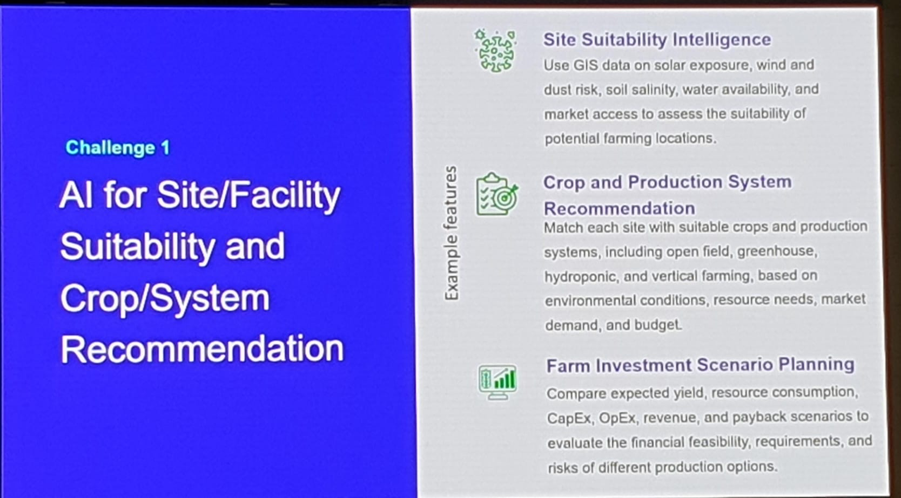
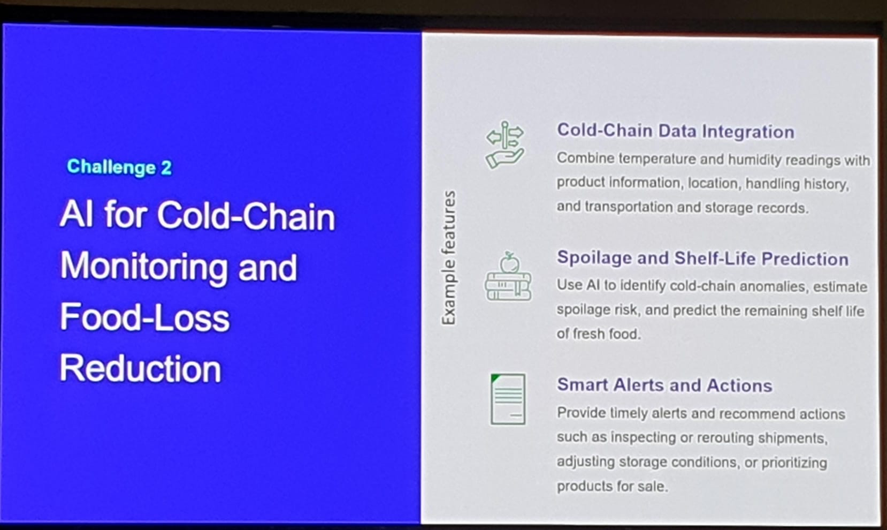
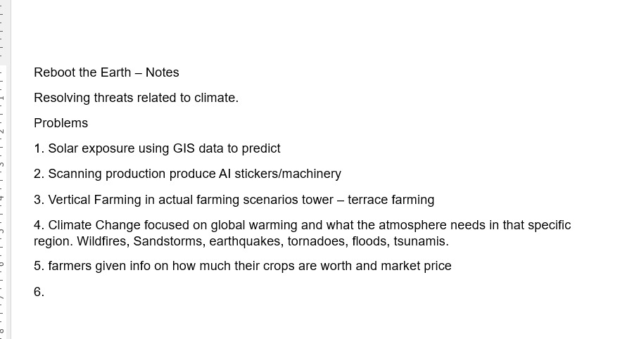
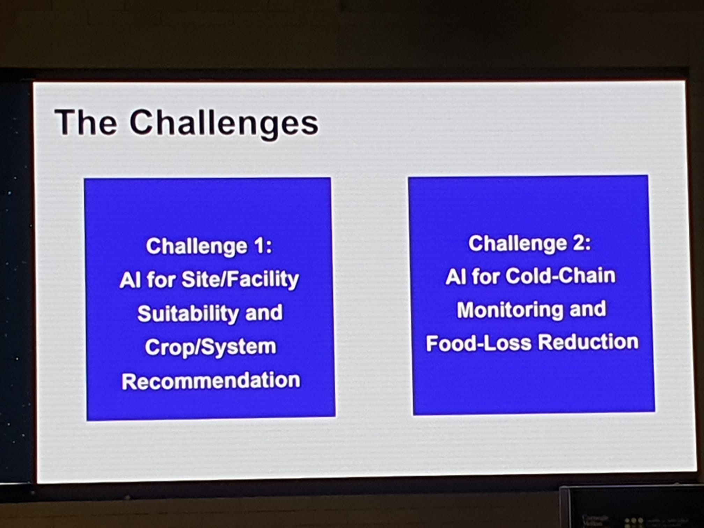

# Hackathon brief: Reboot the Earth Doha 2026

Sep 25, 2026 · @Blay

Everything the organizers gave us, in one place: the challenge, the rules and the judging criteria. Check here before any decision.

## 1. Event and support

**Reboot the Earth Global Tech Challenge 2026, Doha, Qatar, 23–26 September, hosted at Carnegie Mellon University in Qatar.** Organized with the UN Office of Information and Communications Technology and the Hamad Bin Jassim Center at CMUQ.

- **Slack:** all announcements, mentor sign-ups and the workshop schedule. Check your email for the invitation.
- **Mentors:** sessions in the walkway, first come, first served; sign up in advance on Slack. Our target mentor: Vipul Siddharth, Open Source Innovation at UNICEF (online).
- **Workshops:** sustainability, open source, technical presentations and advanced AI; Thursday afternoon to Saturday morning; optional but encouraged.
- **Participant Handbook:** via the QR code on the "Getting Help" slide of the opening deck. It has the submission format and deadline.

## 2. Challenge 1: AI for Site/Facility Suitability and Crop/System Recommendation (our challenge)

**Teams must choose one challenge; we chose Challenge 1.** The three example features, word for word from the slide:

| Example feature | Official description | Where our project covers it |
| --- | --- | --- |
| **Site Suitability Intelligence** | Use GIS data on solar exposure, wind and dust risk, soil salinity, water availability, and market access to assess the suitability of potential farming locations. | Climate pipeline and crop calendar |
| **Crop and Production System Recommendation** | Match each site with suitable crops and production systems, including open field, greenhouse, hydroponic, and vertical farming, based on environmental conditions, resource needs, market demand, and budget. | Crop check, cooling simulation and optimizer |
| **Farm Investment Scenario Planning** | Compare expected yield, resource consumption, CapEx, OpEx, revenue, and payback scenarios to evaluate the financial feasibility, requirements, and risks of different production options. | Solar sizing and economics |

## 3. Challenge 2: AI for Cold-Chain Monitoring and Food-Loss Reduction (for reference)

**We are not building this, but it marks the edge of our scope:** anything about monitoring food after harvest belongs here, not in Challenge 1.

| Example feature | Official description |
| --- | --- |
| **Cold-Chain Data Integration** | Combine temperature and humidity readings with product information, location, handling history, and transportation and storage records. |
| **Spoilage and Shelf-Life Prediction** | Use AI to identify cold-chain anomalies, estimate spoilage risk, and predict the remaining shelf life of fresh food. |
| **Smart Alerts and Actions** | Provide timely alerts and recommend actions such as inspecting or rerouting shipments, adjusting storage conditions, or prioritizing products for sale. |

## 4. Rules, code of conduct and IP policy

**Open source is required, all code must be written during the hackathon, and every dependency must be credited.** Breaking the Code of Conduct can lead to disqualification.

### The rules (opening deck)

| Rule | What it says |
| --- | --- |
| Open Source, Open Data, Open Everything | Open source is required, not just encouraged. Teams are encouraged to use digital public goods as much as possible. |
| Original work and IP | Only the team's own work, plus open-source dependencies with proper attribution. |
| Always be respectful and inclusive | Follow the Code of Conduct at all times and keep a collaborative environment. |
| Inter-team collaboration | Collaboration across teams is welcome, but each team submits its own solution. |
| Code quality | Follow common coding standards and document the code. |

### Code of Conduct

1. **Inclusivity and respect:** treat all participants, organizers, mentors and sponsors with respect; embrace diversity and avoid any discrimination or harassment; keep the atmosphere collaborative and supportive.
2. **Compliance with policies:** follow all [CMU university policies](https://www.cmu.edu/policies/index-a-z/index.html) and the hackathon's [academic integrity policy](https://docs.google.com/document/d/1eodeoOSmjscyP_xMix4VoxyGhQTvvOlcmtPNZPJyB9k/edit?usp=sharing). All projects must be coded only during the hackathon period.
3. **Consequences:** violations can lead to warnings, disqualification or removal from the event.

### Intellectual property policy

1. **Ownership:** teams keep ownership of the IP they create, and must credit any pre-existing IP they use.
2. **License to organizers:** teams give the organizers a non-exclusive license to use and display the project for promotional and educational purposes, and consent to the use of their names, likenesses and project details for hackathon promotion.

Still to do: read the academic integrity policy for its rules on using AI assistants.

## 5. Judging criteria and How to Win

**Seven criteria apply to all challenges.** The official wording is in the middle column; the right column is how our project answers each one.

| # | Criterion | Official description | How we meet it |
| --- | --- | --- | --- |
| 1 | Solution Effectiveness and Prototype Readiness | How well the prototype addresses the selected challenge and demonstrates its core functionality. | Live demo: pin in, buildable farm plan out, covering all three Challenge 1 features |
| 2 | Creativity and Innovation | How original and innovative the team's approach is compared with existing solutions. | Wet-bulb insight: same temperature, different greenhouse; solar power matched to cooling demand |
| 3 | Scope and Effort | How appropriate and substantial the team's work is, considering the hackathon timeframe. | Full data pipeline, hourly physics, optimizer and AI agent, sized to finish in time |
| 4 | Technical Execution and Feasibility | How technically sound, well explained, and feasible the solution is using the available resources and technologies. | Real physics and open data; every number traceable |
| 5 | Communication and Presentation | How clearly and convincingly the team communicates its solution, decisions, and potential impact. | One story: the Gulf has too much sun; two-pin demo |
| 6 | Open-Source Alignment | How effectively the solution uses open technologies and enables others to access, reuse, or adapt the work. | MIT code, open data and libraries, editable CSVs for any country |
| 7 | Sustainability and SDG Alignment | How strongly the solution supports environmental sustainability and relevant UN Sustainable Development Goals. | SDGs 2, 6, 7 and 13; less wasted water and energy |

### How to Win Reboot 2026 (opening deck)

1. **Use AI responsibly:** innovative, ethical and privacy-respecting uses of AI to solve previously intractable problems.
2. **Relevance to societal challenges:** address a pressing need in society, delivering change in a previously unexplored dimension.
3. **Open source and a digital public good:** on track to become a digital public good, working towards the SDGs and following the Digital Principles.
4. **Scalable, with real-world impact:** a tangible roadmap for growth, public adoption and global impact.

## 6. Our original brainstorm notes

**Where the project started, and what we kept.** The notes as written, with what happened to each idea:

| # | Original note | What we did with it |
| --- | --- | --- |
| 1 | Solar exposure using GIS data to predict | **Kept:** the core of the project |
| 2 | Scanning production produce AI stickers/machinery | Dropped: belongs to Challenge 2 |
| 3 | Vertical farming in actual farming scenarios, tower and terrace farming | Roadmap: a future setup option |
| 4 | Climate change focused on global warming and what the atmosphere needs in that specific region. Wildfires, sandstorms, earthquakes, tornadoes, floods, tsunamis. | **Kept, narrowed:** heat, humidity and dust; 2040 climate as a stretch feature |
| 5 | Farmers given info on how much their crops are worth and market price | **Kept:** crop prices drive the payback numbers |

We also discussed an SMS flood-warning idea, which is off-brief for Challenge 1.

## 7. Original files

**The organizers' originals, kept here so the team never works from memory.**

- The full 15-slide opening ceremony deck (PDF), with hosts, mentors, rules, both challenges and How to Win:

[Opening ceremony deck (PDF)](assets/opening-ceremony-deck.pdf)

- The challenges overview slide:

