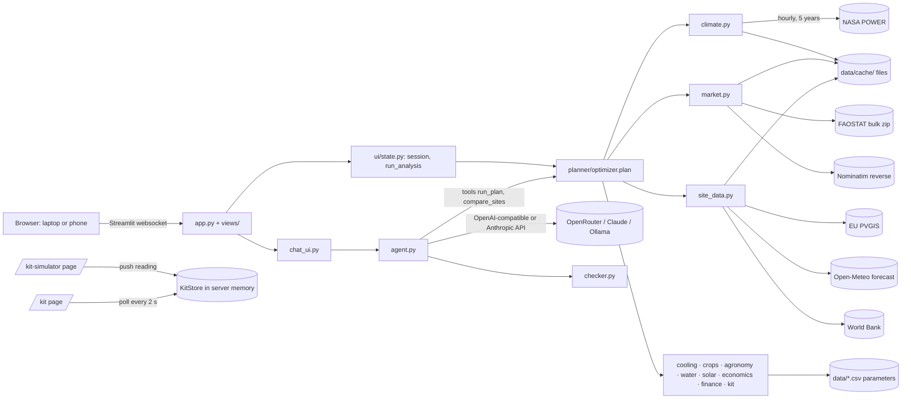

# System architecture

Sep 26, 2026 · describes `main` as deployed to https://croptions.streamlit.app

**Croptions is one Python app with no database and no backend server of its own.** Streamlit serves the pages. A pure-Python planner (`planner/`) does the physics and money from open data. Parameters live in version-controlled CSV files, downloaded data is cached as files, and the only shared live state (the Croptions Kit readings) is held in server memory. An LLM is optional: it explains the plan, and a number checker makes sure it only repeats numbers the planner calculated.

## 1. The picture

## 2. Runtime and hosting

| Item | Detail |
| --- | --- |
| Language | Python 3.11 (CI and devcontainer); pinned packages in `requirements.txt` |
| Web framework | Streamlit 1.64: `st.navigation(position="hidden")` with our own top bar, `st.dialog` for the assistant, `st.fragment(run_every=2)` for the live kit, keyed containers styled by CSS (`ui/theme.py`) |
| Libraries | pandas 3.0.6, NumPy 2.4.6, Plotly 7.1.0, folium 0.20.0 + streamlit-folium 0.27.4 (Leaflet map with Esri satellite and OSM tiles), PsychroLib 2.5.0 (wet-bulb; Stull formula fallback), pycountry 24.6.1, requests 2.33.1, anthropic 1.8.0, python-dotenv 1.2.3, pytest 9.1.1 |
| Hosting | Streamlit Community Cloud, deployed from the `main` branch of `Jawad-23/RTE-Hack`; one container and one Python process, so every visitor shares the same memory and the same `data/cache/` files |
| Secrets | Streamlit Cloud **Settings → Secrets** (TOML). Locally a `.env` file (git-ignored). `agent._cfg()` reads `.env`/environment first, then `st.secrets` |
| CI | GitHub Actions `.github/workflows/tests.yml`: on every push and pull request, Ubuntu, Python 3.11, `pip install -r requirements.txt`, `python -m pytest -q` |
| Dev container | `.devcontainer/devcontainer.json` (Codespaces): Python 3.11 image, installs requirements, starts Streamlit on port 8501 with CORS and XSRF protection turned off (fine for a private codespace, never for a public server) |
| Theme | `.streamlit/config.toml` (Croptions colours, no sidebar navigation) plus the CSS in `ui/theme.py`; fonts IBM Plex Sans / Sans Arabic / Mono from Google Fonts; Arabic switches the page to right-to-left |

## 3. Storage: there is no database

| What | Where | Lifetime | Written by |
| --- | --- | --- | --- |
| Model parameters: crops, setups, settings, kit scenarios, demo pins | `data/crops.csv`, `setups.csv`, `settings.csv`, `kit_scenarios.csv`, `demo_sites.csv`; every row has a `source` (`estimate` if none) | Version-controlled | People, by pull request |
| NASA typical year per pin | `data/cache/v2_<years>_<lat>_<lon>.csv` + `.json` (years used, fetch date, warnings) | Until the year range changes (next January) | `climate.get_typical_year` |
| FAOSTAT prices | `data/cache/faostat_prices.csv` (downloaded) or `data/snapshots/faostat_prices.csv` (committed); the newer one wins | Re-downloaded when both are ≥ 30 days old; a failed download is not retried for 6 hours | `market.load_price_table` |
| Pin → country | `data/cache/countries.json` | Permanent | `market.country_for` (Nominatim) |
| PVGIS, World Bank | `data/cache/site/pvgis_*.json`, `money_*.json` | 30 days | `site_data._cached` |
| 7-day forecast | `data/cache/site/forecast_*.json` | 3 hours | `site_data._cached` |
| Failed online extras | In memory (`site_data._failed`) | Service skipped for 15 minutes | `site_data._cached` |
| Typical year in memory | `st.cache_data` on `state.climate_for` (16 pins) | Until restart | `ui/state.py` |
| Croptions Kit readings | `KitStore` in `st.cache_resource` (`ui/kit_ui.store()`): Kit ID → context + readings | Until the app restarts; IDs expire after 24 h; 200 farms, 2,000 readings each | Simulator page, read by the Kit page |
| Per-visitor state | `st.session_state`: `lang`, `pin`, `area`, `budget`, `crop`, `priority`, `plan`, `compare`, `chat`, `chat_plan_sig`, `_kit_code`, `_kit_log`, `_kit_screen`, … | One browser tab | Pages |
| Share links | URL query parameters `?lat=&lon=&area=&budget=&priority=&crop=&cleaning=&lang=`; `state.init()` re-runs the plan from them | In the link | `state.run_analysis` |

On Streamlit Cloud `data/cache/` is on the container's disk and disappears when the app is rebuilt or sleeps; everything in it is re-fetched on demand.

## 4. External APIs (all free, none needs a key except the LLM)

| Service | Endpoint and parameters | Used for | Module | If it fails |
| --- | --- | --- | --- | --- |
| NASA POWER hourly | `GET https://power.larc.nasa.gov/api/temporal/hourly/point` · `community=AG`, `time-standard=LST`, one calendar year per call, the last 5 full years · `T2M, RH2M, ALLSKY_SFC_SW_DWN, WS2M, ALLSKY_SFC_PAR_TOT, ALLSKY_SFC_UVA, ALLSKY_SFC_UVB, ALLSKY_SFC_LW_DWN, CLRSKY_SFC_SW_DWN, CLRSKY_SFC_PAR_TOT` | The 8,760-hour typical year (average of each month-day-hour across years; -999 → NaN; 29 Feb dropped) | `climate.py` | 3 retries, 90 s timeout; offline stops at once. No cache and no data → the plan says "No climate data", never invents weather |
| FAOSTAT bulk | `GET https://bulks-faostat.fao.org/production/Prices_E_All_Data_(Normalized).zip` | Latest farm-gate price per crop for the pin's country (USD/t → QAR/kg at 3.64) | `market.py` | Committed snapshot (fetched 2026-09-26) |
| OSM Nominatim | `GET /reverse` (country of the pin) and `GET /search` (place search on the Plan page); `User-Agent: Croptions/1.0` | Country for prices; finding a place by name | `market.py`, `views/plan.py` | World median prices, said on screen |
| EU JRC PVGIS 5.3 | `GET https://re.jrc.ec.europa.eu/api/v5_3/PVcalc` · `peakpower=1, loss=14, optimalangles=1, outputformat=json` | Solar yield per kW with terrain horizon, best tilt and compass bearing, heat loss, monthly yield | `site_data.pvgis` | Card hidden |
| Open-Meteo forecast | `GET https://api.open-meteo.com/v1/forecast` · daily `temperature_2m_max, relative_humidity_2m_mean, uv_index_max, shortwave_radiation_sum, et0_fao_evapotranspiration`, 7 days | "This week" heat days and UV | `site_data.forecast` | Card hidden |
| World Bank | `GET https://api.worldbank.org/v2/country/{ISO3}/indicator/{FR.INR.LEND, FP.CPI.TOTL.ZG}?format=json&mrnev=1` | Real discount rate = (1 + lending) / (1 + inflation) − 1 | `site_data.money`, `finance.py` | 4 % fallback from `settings.csv`, said on screen |
| Open-Meteo Air Quality (CAMS) | `GET https://air-quality-api.open-meteo.com/v1/air-quality` · `hourly=dust, past_days=30` | Recent dust exposure, on a button press only | `dust.py` | "Dust data unavailable", no number |
| Map tiles | Esri World Imagery, OpenStreetMap | The Plan map | `views/plan.py` | Typed coordinates and place search still work |
| LLM | See section 6 | The assistant | `agent.py` | The dashboard works; the chat says it is unavailable, or shows a template summary |

## 5. What happens when you press Analyse

1. `ui/state.run_analysis()` reads the pin and inputs from the session and calls `optimizer.plan(lat, lon, area_m2, budget_qar, priority, crop, cleaning_interval_days=…)`.
2. `climate.get_typical_year` returns 8,760 hourly rows: temperature, humidity, sunlight, wind, PAR, UV, clear-sky and the infrared (heat) share of sunlight.
3. `crops.crop_calendar` rates each crop good / risky / impossible for every month, outdoors.
4. `market.prices_for` finds the country and the latest FAOSTAT price for each crop.
5. For each of the **56 options** (8 crops × 7 setups):
   - **Heat:** `cooling.hourly_profile` gives the inside temperature every hour (wet-bulb physics, pad efficiency, shade, NIR screen, chiller setpoint, and the louver screen driven by `controller.decide`).
   - **Energy and solar:** PV output and grid use.
   - **Crop checks:** light (DLI) and humidity (VPD) in `agronomy.py`.
   - **Water:** crop and pad water, hourly FAO-56 Penman-Monteith in `water.py`.
   - **Solar sizing:** `solar.size_solar`.
   - **Money:** build cost, running cost, revenue, profit and payback in `economics.py`.
   - **Pass rule:** an option passes if heat coverage ≥ 90 %, light OK on ≥ 90 % of growing days, and it is within budget.
6. `finance.evaluate` adds NPV, IRR, break-even price and downside cases, discounted at the World Bank real rate.
7. Passing options are ranked by the priority: 10-year profit, fastest payback, or least water. The best one is `recommended`.
8. The plan adds:
   - `site` (headline climate plus `site_climate.summary`, the "What NASA measured" card);
   - `kit` (pods, and cost and payback with the kit);
   - `finance`, `solar_gis` (PVGIS) and `forecast` (Open-Meteo);
   - `calendar`, `sources` and `assumptions`.
9. `to_json_safe` turns everything into plain JSON (NaN → None). The same dict feeds the pages, the JSON download and the LLM.

A first run for a new pin takes up to about a minute (five NASA downloads). After that, a plan takes seconds.

## 6. The assistant (LLM)

| Setting (`.env` or Secrets) | Deployed value | Default in code |
| --- | --- | --- |
| `LLM_PROVIDER` | `openai_compatible` | `anthropic` |
| `LLM_BASE_URL` | `https://openrouter.ai/api/v1` | `http://localhost:11434/v1` (Ollama) |
| `LLM_MODEL` | `qwen/qwen3.8-27b:free` (see `.env.example`) | `claude-sonnet-5` (Anthropic) or `qwen2.5:7b-instruct` |
| `LLM_FALLBACK_MODELS` | `nvidia/nemotron-3-super-120b-a12b:free,openrouter/free` (sent as OpenRouter's `models` list) | none |
| `LLM_API_KEY` / `ANTHROPIC_API_KEY` | set in Secrets (never in the repo) | empty |
| `APP_URL` | https://croptions.streamlit.app (OpenRouter `HTTP-Referer`) | same |

- **One entry point:** `agent.call_llm()` is the only function that talks to a model.
  - OpenAI-compatible servers get `POST {BASE_URL}/chat/completions` with tools, `temperature 0.4` and `max_tokens 4096`, with a 180 s timeout.
  - Anthropic gets `messages.create` with no temperature.
  - Both answers are converted to the same shape.
- **Tools:**
  - `run_plan(lat, lon, area_m2, budget_qar, priority, crop?)` runs the real planner. A what-if result replaces the plan on screen.
  - `compare_sites(site_a, site_b, …)` runs two plans.
  - At most 5 tool rounds per question.
- **Prompt:** the system prompt (friendly advisor, under 150 words, never invent numbers, plain setup names), plus a compact copy of the plan: options, site, finance, kit, PVGIS and forecast. Arabic questions get the app's Arabic crop and setup names.
- **Number checker (`checker.py`):**
  - It extracts every number in the reply, including Arabic digits, "175k" and "175 thousand". Each must match a number in the plan, a tool result or the user's message, within 1 % or ±0.1. Month numbers and years pass.
  - On failure the model is asked to rewrite once, without tools. A second failure replaces the answer with a template built only from plan fields.
- **Results page:** the chat opens with a summary (`agent.summarize`) whenever a new plan arrives from the Plan page. It is the same conversation as the **Ask Croptions** dialog. Without an LLM the summary is the template, marked verified.

## 7. Pages

| Page (URL) | File | What it does |
| --- | --- | --- |
| Home (`/`) | `views/home.py` | Pitch, "Try Al Khor" demo, what the planner checks, the Croptions Kit block |
| Plan (`/plan`) | `views/plan.py` | Map (click a pin or draw a rectangle), place search, coordinates, farm size, budget, crop, priority, dust scenario, area scan (up to 25 points, CSV) |
| Results (`/results`) | `views/results.py` | Verdict; 6 key numbers; assistant summary and chat; Croptions Kit card (cost with the kit, latest reading); investment table; NASA climate card with charts; PVGIS and forecast; recent dust; crop calendar; setup comparison; compare a second site; inside-temperature, hottest-day and cumulative-profit charts; diagnostics; assumptions and sources |
| Compare sites (`/compare`) | `views/compare.py` | Two sites with the same inputs; "same heat, different air" only when the data shows it |
| Croptions Kit (`/kit`) | `views/operate.py` | Kit ID, control mode (Auto / Approve once / Manual), live tiles (leaf, air, humidity, light, CWSI, VPD, dew-point gap, light so far), advice, thermal image, alerts, readings chart, CSV |
| Assumptions (`/assumptions`) | `views/assumptions.py` | Every CSV row with its source, and the FAOSTAT prices used |
| Kit simulator (`/kit-simulator?farm=ID`) | `views/kit_remote.py` | Hidden; no top bar. Scenario buttons (Normal, Heat stress, Dry air, Sun surge, Humid night) and "Stream the day" |

## 8. Croptions Kit data flow

1. The Kit page builds the farm's day: `kit.day_conditions` runs `cooling.hourly_profile` for today's date, the recommended setup and the crop. It then registers that context in the `KitStore` and shows the 4-digit Kit ID.
2. The simulator (a phone or a second tab) calls `kit.simulate_reading`: that hour's inside conditions, a scenario offset from `kit_scenarios.csv`, a leaf temperature between the transpiring and non-transpiring limits, and sensor noise. It pushes `{farm_code, seq, sent_at, sim_day, sim_hour, scenario, leaf_c, air_c, rh_pct, par_w_m2, source: "simulated"}`.
3. Every 2 seconds the Kit page:
   - pulls any new readings;
   - `kit.derive` works out VPD, dew point, the leaf's gap above dew point, CWSI and alerts;
   - `kit.recommend` runs the same `controller.decide` rule the planner uses;
   - applies the advice according to the control mode.
4. `kit.costs` (in the plan) adds `ceil(area / 500 m²)` pods at 2,000 QAR plus 300 QAR per pod per year. These are placeholder prices from `settings.csv`, and no yield gain is assumed.

## 9. Module reference

| File | Responsibility |
| --- | --- |
| `app.py` | Page config, CSS, page registry, top bar with menu, language switch, assistant dialog |
| `ui/state.py` | Session defaults, widget persistence, formatting, `run_analysis`, share-link restore, cached climate |
| `ui/theme.py`, `components.py`, `charts.py`, `insights.py`, `kit_ui.py` | Design tokens and CSS; HTML blocks (tiles, calendar, tables, kit pitch, investment table); Plotly charts; chart summaries; the Kit store and simulator buttons |
| `planner/schemas.py` | Shared names: climate columns, 7 setups, statuses, thresholds (90 % coverage, 90 % light), priorities |
| `planner/climate.py` | NASA POWER download, typical year, cache, source info |
| `planner/cooling.py` | Wet-bulb, the hourly inside climate for each setup, chiller energy, PV on the structure, coverage |
| `planner/controller.py` | Rule-based screen: protect light, reduce heat, hysteresis, 10 % steps |
| `planner/agronomy.py`, `water.py` | VPD and DLI checks; FAO-56 hourly ET0, crop coefficients, pad water |
| `planner/crops.py`, `solar.py`, `economics.py` | Crop calendar; solar sizing; cost, profit, payback |
| `planner/finance.py` | NPV, IRR (bisection), break-even price, −20 % price and +20 % build-cost cases |
| `planner/market.py` | FAOSTAT prices, country lookup, ISO3 code |
| `planner/site_climate.py`, `site_data.py` | NASA climate card; PVGIS, forecast and World Bank with caching |
| `planner/dust.py`, `scan.py`, `operate.py` | Soiling scenarios and CAMS dust; area scan; one-day screen simulation (kept, not shown) |
| `planner/kit.py` | Kit scenarios, readings, CWSI/VPD/dew point, advice, thermal image, costs, `KitStore` |
| `planner/agent.py`, `checker.py`, `chat_ui.py` | LLM provider layer and tool loop; number checker; chat UI |
| `i18n/en.json`, `ar.json` | 458 strings, identical keys in both languages (a test enforces it) |
| `scripts/validate_demo.py` | Checks the public APIs live and caches the demo sites |

## 10. Tests

136 pytest tests. They never touch the network: `conftest.py` provides synthetic climate years and stubs FAOSTAT, the country lookup, PVGIS, the forecast and the World Bank. The LLM is replaced by a scripted fake (Anthropic shape) or a fake OpenAI-compatible server. Streamlit `AppTest` renders every page in English and Arabic, with and without a plan, including the kit simulator → dashboard round trip.

## 11. Security notes

- **No keys in the repo:** `.env` and `.streamlit/secrets.toml` are git-ignored, and the git history was checked for keys before the repo went public.
- **Escaping:** HTML is built with `html.escape` for text from data files and the site name. Chat replies in English are rendered as Markdown.
- **The Kit ID is not a password:** anyone who knows or guesses a 4-digit Kit ID can send readings to that dashboard. That is fine for a demo; real pods need authentication.
- **Devcontainer:** it disables CORS and XSRF protection, which is acceptable only inside a private codespace.
